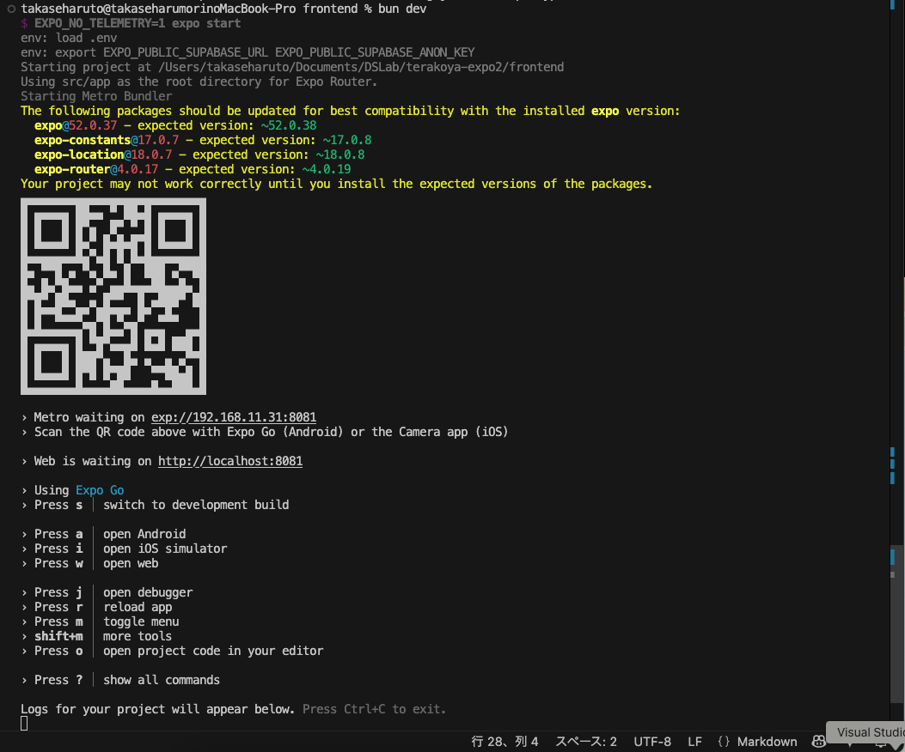
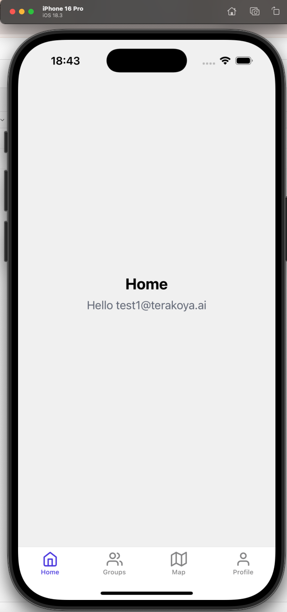
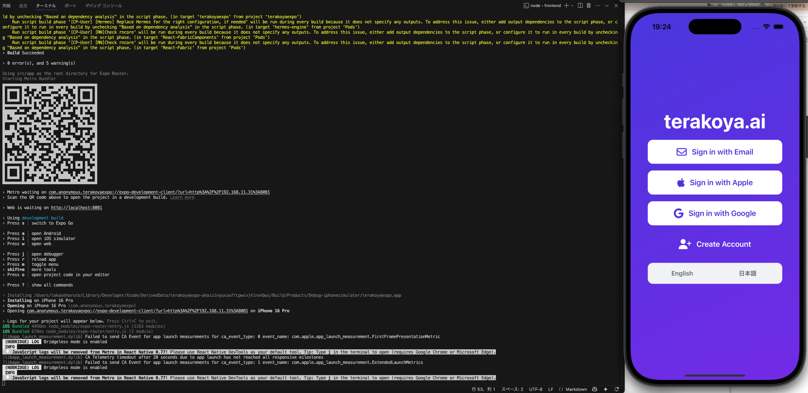
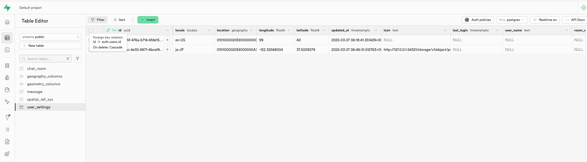

# Terakoya Expo App

This README provides instructions on how to set up, run, and develop the Terakoya Expo application.

## 📋 Requirements

Before you begin, ensure you have the following tools installed:

- **Homebrew:** Package manager for macOS. ([Installation Guide](https://brew.sh/))
- **Colima:** Container runtimes on macOS (used here to run Docker). ([GitHub Repository](https://github.com/abiosoft/colima))
- **Supabase CLI:** Command line interface for Supabase. ([Installation Guide](https://supabase.com/docs/guides/cli))
- **Bun:** Fast JavaScript runtime, bundler, and package manager. ([Installation Guide](https://bun.sh/docs/installation))

## 🚀 Getting Started

Follow these steps to get the project running on your local machine.

1.  **Clone the Repository:**

    ```bash
    git clone git@github.com:Terakoya-ai/terakoya-expo.git
    cd terakoya-expo
    ```

2.  **Install Root Dependencies:**
    Install the necessary dependencies for the entire project.
    ```bash
    bun install
    ```

## ⚙️ Backend Setup (Supabase)

Set up the local development environment for the backend using Supabase.

1.  **Start Colima:**
    Ensure your Docker environment is running via Colima.

    ```bash
    colima start
    ```

2.  **Start Supabase:**
    Navigate to the backend directory and start the Supabase local development server.
    ```bash
    cd backend
    supabase start
    ```
    _(Note: If you encounter issues, you might need to run `supabase stop` first before starting.)_

## 📱 Frontend Setup (Expo)

Configure the frontend Expo application.

1.  **Create Environment File:**
    Navigate back to the root directory, then into the `frontend` directory. Create a `.env` file:

    ```bash
    # Make sure you are in the project root directory first if you just finished backend setup
    # cd ..
    cd frontend
    touch .env
    ```

    Add the following content to your `frontend/.env` file.
    You can see supabase URL and AnonKey from **Studio URL** in `supabase start` log.
    These credentials are for the local Supabase instance:

    ```plaintext
    EXPO_PUBLIC_SUPABASE_URL=...
    EXPO_PUBLIC_SUPABASE_ANON_KEY=...
    ```

2.  **Install Frontend Dependencies:**
    Make sure you are in the `frontend` directory and install its specific dependencies.
    ```bash
    # If not already in the frontend directory: cd frontend
    bun install
    ```

## ▶️ Running the App with Expo Go

Expo Go allows you to quickly run and test your app during development on a simulator or physical device without needing to build the native code.

1.  **Start the Development Server:**
    Ensure you are in the `frontend` directory.

    ```bash
    # If not already in the frontend directory: cd frontend
    bun dev
    ```

2.  **Open in Simulator/Device:**
    Once the server starts, you will see a QR code and options in the terminal.
    

    - Press `i` to open the app in the iOS Simulator.
    - Press `a` to open the app in an Android Emulator/Connected Device.
    - Press `w` to open the app in your web browser.
    - Alternatively, scan the QR code using the Expo Go app on your physical iOS or Android device.

3.  **Test Credentials:**
    Use the following credentials to log in:

    - **Username:** `test1@terakoya.ai` or `test2@terakoya.ai`
    - **Password:** `123456`

    

## 🛠️ Running with Development Build (for Map Feature)

This project uses [MapLibre React Native](https://maplibre.org/maplibre-react-native/docs/setup/getting-started/) for displaying maps with [MapTiler](https://cloud.maptiler.com/maps/).

**Why Use Development Build?**
[MapLibre React Native does not support Expo Go](https://maplibre.org/maplibre-react-native/docs/setup/expo). Therefore, to test features involving the map, you need to create a Development Build, which includes the native map library code. Development Builds allow for native code compilation, offering more customization and capabilities than Expo Go.

**Prerequisites:**
First, you need to download and set up the native development environments:

- **Xcode:** For iOS development. ([Expo Docs: iOS Simulator](https://docs.expo.dev/workflow/ios-simulator/))
- **Android Studio:** For Android development. ([Expo Docs: Android Studio Emulator](https://docs.expo.dev/workflow/android-studio-emulator/))

**Build and Run Commands:**
Ensure you are in the `frontend` directory. To run a Development Build, instead of using `bun dev`, use the following commands:

- For iOS:
  ```bash
  npx expo run:ios
  ```
- For Android:
  ```bash
  npx expo run:android
  ```

**Important Notes:**

- **Initial Build Time:** The first time you run these commands, the build might take a significant amount of time as it needs to download and compile numerous native packages.
- **Native Folders:** This process creates the `ios` and `android` folders within your `frontend` directory, enabling the use of native packages.
- **iOS Dependencies:** On iOS, native packages (like MapLibre) are managed using CocoaPods. The `npx expo run:ios` command automatically handles the `pod install` process.



## 🗺️ Map Feature Setup

This section details the setup required for the map functionality, including API keys and background location tracking.

### MapTiler API Key

This project uses the [MapTiler](https://www.maptiler.com/) service for map tiles. You need to add your MapTiler API key to the `frontend/.env` file.

1.  Obtain an API key from the [MapTiler Cloud](https://cloud.maptiler.com/).
2.  Add the following line to your existing `frontend/.env` file, replacing `<YOUR_MAPTILER_API_KEY>` with your actual key:

    ```plaintext
    EXPO_PUBLIC_MAPTILER_API_KEY=<YOUR_MAPTILER_API_KEY>
    ```

### Background Location (iOS)

To fetch real-time location updates from iOS devices, even when the app is in the background, we use the [react-native-background-geolocation](https://github.com/transistorsoft/react-native-background-geolocation?tab=readme-ov-file) package.

- **Setup:** Follow the official [Expo Setup guide](https://github.com/transistorsoft/react-native-background-geolocation/blob/master/help/INSTALL-EXPO.md) for installation and configuration.
- **Android License:** Please note that the Android version of this package requires a paid license. This project currently implements it primarily for iOS background tracking.
- **Initialization Issue:** A known issue ([#2300](https://github.com/transistorsoft/react-native-background-geolocation/issues/2300)) might cause the status `BackgroundGeolocation is configured and ready: false` if following the basic tutorial steps.
- **Workaround:** To resolve the initialization issue, ensure you call `BackgroundGeolocation.start()` before other configurations or status checks within your code.
- **Developer Note:** The optimal timing and conditions for calling `BackgroundGeolocation.stop()` are currently under investigation and need further refinement.

**Important:** Since `react-native-background-geolocation` involves native code, you **must** use a [Development Build](#️-running-with-development-build-for-map-feature) (or a production build) to test the background location features. It will **not** work with Expo Go.



